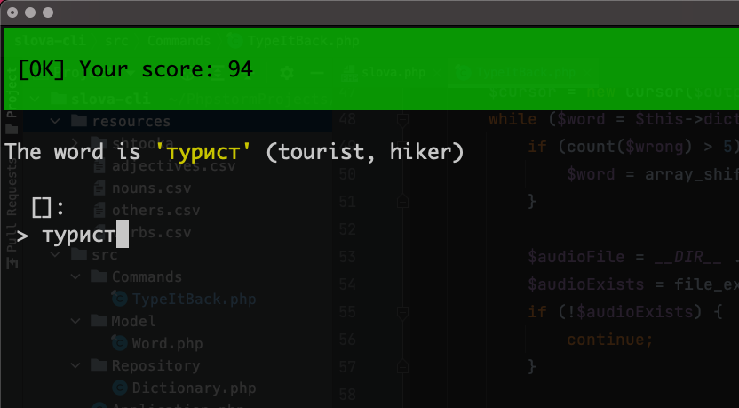

Slova
---

A simple CLI tool I wrote to help me learn Russian.



## Dependencies

### Afplay
This CLI tool uses the program `afplay` to play audios
using the command line.

## Game: Type it back!

**Focus:** read and write using the cyrillic alphabet.

The cyrillic alphabet can be very tricky for beginners. This
game aims to help you exercise your read and write skills.

### Dependencies

This game plays audio. Make sure you run the following
command before playing it:

```bash
$ php resources/shtooka/download-dict-mp3.php
```

The above command will download about 6400 mp3 files, each
with the pronunciation of a single russian word.

### How it works

You start with a low level. As you type words correctly,
longer and longer words may appear. If you consistently
make a mistake, the game may repeat the problematic
word to help you fixate it.

Before and after typing a word, the program will play an
audio with its pronunciation. This helps the reading
process.

Running:

```php
$ php slova.php typeitback
```
